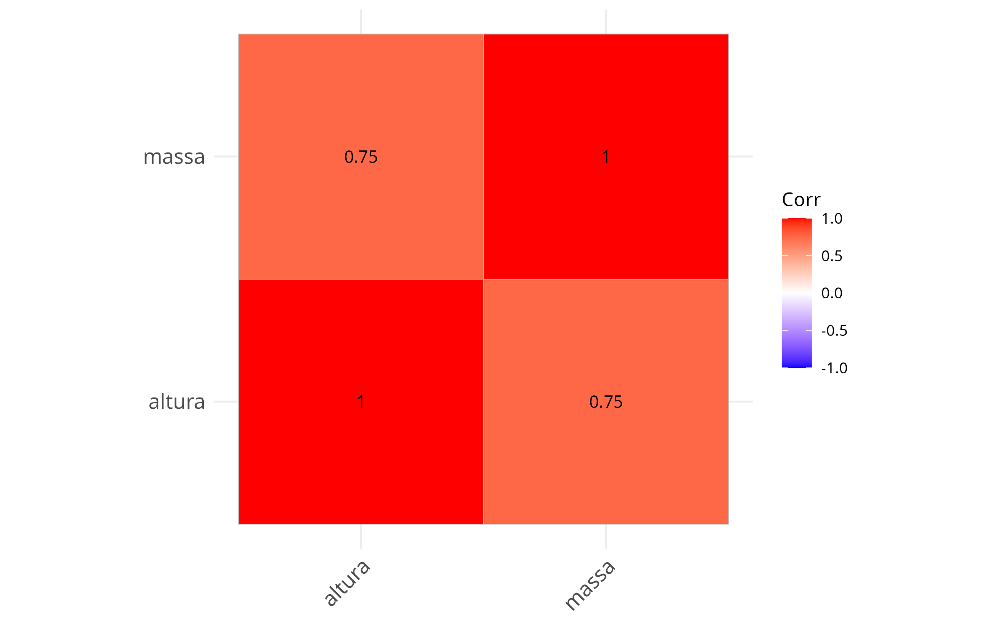
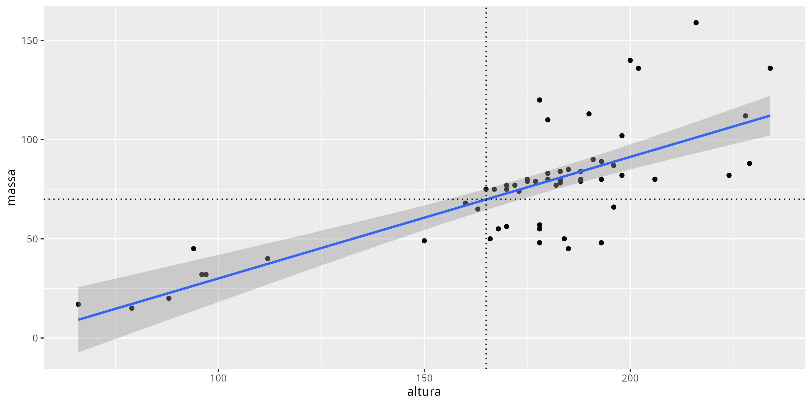
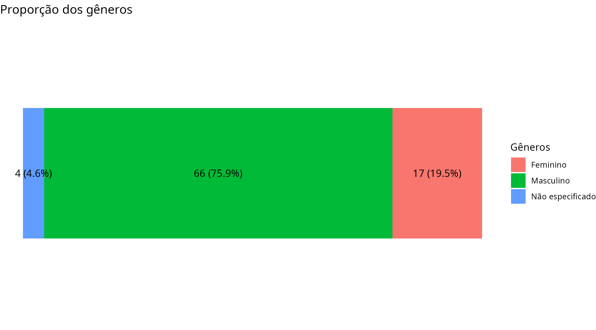
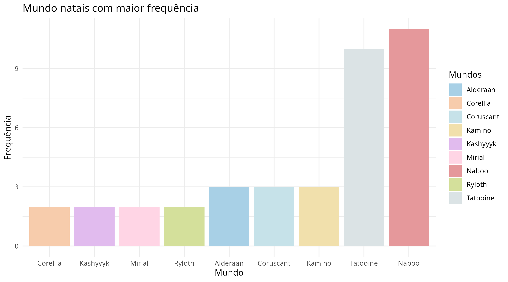
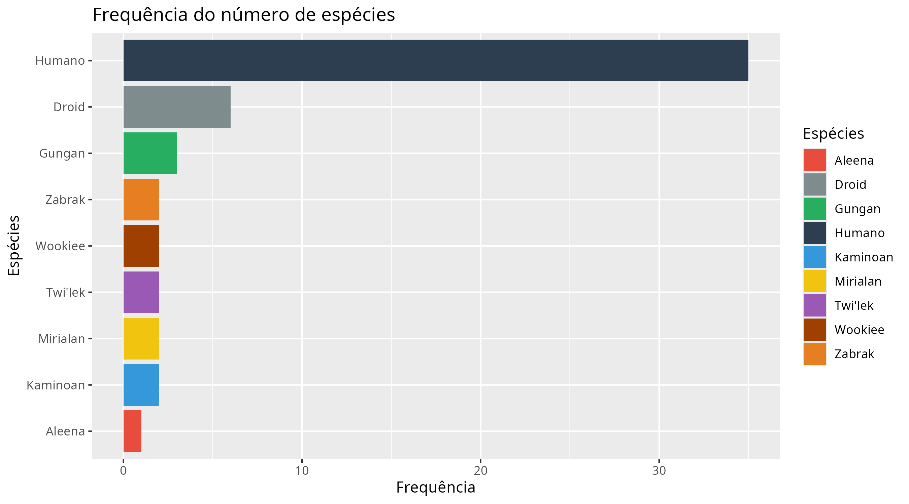

# *Análise exploratória com dados de Star Wars*

Análise exploratória da tabela "starwars". Com base nos dados fornecidos pela 
biblioteca `Tidyverse`, foram feitos tratamento e análise. 

   -> Com esta análise, foi possível aplicar limpeza e transformação dos dados com
   `dplyr` e `tidyr` (Tidyverse) de forma que as informações ficassem claras e de fácil
   leitura;
   
   -> Análises de correlações, frequências e proporções feitas e documentadas de
   forma precisa e clara para a identificação de padrões e tendências;
   
   -> Foram criados gráficos seguindo práticas recomendadas utilizando o `ggplot2`
   (Tidyverse), como a utilização de cores suaves e agradáveis para os olhos humanos.

## *Stack*
- R;
- RMarkdown;
- Tidyverse;
- Ggcorrplot.

## *Objetivos*

- Realizar tratamento dos dados "starwars";
- Analisar os dados limpos e gerar conclusões;
- Documentar passos, conclusões e considerações.

## *Execução*

- Clonagem do repositório;
- Executar `scripts/cleaning.Rmd`;
- Executar `scripts/analysis.Rmd`.

## *Estrutura*

- `data/raw`: Dados originais.
- `data/clean`: Dados após tratamento (limpos).
- `scripts/cleaning.Rmd`: Script responsável pelo filtro inicial e limpeza dos dados.
- `scripts/analysis.Rmd`: Script responsável pela análise dos dados usando gráficos e tabelas.

## *Considerações do tratamento dos dados*

1. **Nome das colunas traduzido**

   Fiz a tradução dos nomes das colunas utilizadas para a análise para facilitar
   e deixar a leitura dos scripts mais amigável.
   
2. **Valores NA trocados para a mediana da altura**

   Como na coluna altura tinham 6 valores (~6,90%) NA de 87 no total, foi optado a alteração
   desses valores para a mediana (180) pois, como é um valor 180cm é um valor factível
   no quesito altura e 6,90% de 87 ocorrências não é uma porcentagem alta de valores
   faltantes, não iria prejudicar a análise.
   
3. **Tipo de valor de idade modificado para inteiro**

   Para idades, valores inteiros (sem casas decimais) foram escolhidos pois é
   a forma mais comum de ler idades. Levei em consideração que no mundo de Star
   Wars, não é irreal usar valores com casas decimais, porém, para a análise,
   o uso de números inteiros foi preferido.
   
4. **NAs da coluna gênero e espécie trocados para "not specified"**

   Na coluna de gêneros e espécie dos personagens, não havia um número alto de valores NA,
   mas foi optado a troca para "not specified" (não especificado) para não
   alterar a proporção.
   
5. **Valores NA que não foram modificados**

   - `Massa`: 28 valores faltantes de 87 no total é aproximadamente 32%, um número
    significativo e que enviesaria a análise.
   - `Idade`: 44 valores faltantes de 87 é mais de 50% do total, seria irreal
    trabalhar com esse número.
   - `Mundo natal`: Não havia muitos valores NA, mas com a variedade de valores
    diferentes, alterar para "not specified" não haveria importância. 

## *Considerações da análise dos dados*

1. **Correlação entre altura e massa**

   Existe uma correlação significativa entre os dados "altura" e "massa". Depois de analisar
   a tendência de correlação de forma simples usando a biblioteca `Ggcorrplot`, primeiramente
   sem filtros, o resultado do cálculo foi 0.13 (baixa correlação).

   No entanto, após filtrar o único outlier (massa < 1000), apresentou uma correlação 
   considerável de 0.75.
  
   Então, o filtro também foi realizado no momento de criação do gráfico foi confirmado via 
   gráfico de dispersão que a tendência é real (não obrigatória): quanto maior for o sujeito,
   a massa tende a aumentar da mesma forma.
   
   O responsável pelo outlier é Jabba Desilijic Tiure.

   
   
   
2. **Diferença considerável na proporção entre gêneros**

   Ao analisar a proporção entre personagens masculinos e femininos, foi notado
   que mais de 75% dos personagens são do gênero masculino, enquanto 19.50%
   são femininos e 4.6% não foram especificados.
   
   Desta forma, isso influencia a análise da distribuição da cor do olho
   dos personagens. O gênero masculino tem variedade e concentração maiores de
   cores de olho, enquanto o gênero feminino possui menos. 
   
   Então, quanto mais ocorrências tiver um determinado gênero, a probabilidade 
   da varidade da cor de olho aumentar é relevante.
   
   
   
3. **Distribuição por origem (Mundos Natais)**

   Percebendo que há uma diferença possivelmente relevante na quantidade de vezes
   em que os mundos Naboo e Tatooine aparecem comparado a outros mundos, foi feito
   um gráfico de colunas para análise, o que exemplificou essa diferença.
   
   Com base nos resultados obtidos a partir do gráfico, pode-se concluir que, de
   acordo com este dataset, os personagens se concentram mais nos mundos Naboo e
   Tatooine do que nos demais mundos.
   
   

4. **Frequência de espécies**

   Com o mesmo método utilizado para analisar a distribuição por origem, é notável
   a diferença entre a frequência de humanos neste dataset do que qualquer outra
   espécie.

   A espécie humana possui 35 ocorrências, 6 vezes mais do que a segunda espécie com
   mais ocorrências, no caso, Droid. No entanto, neste dataset, Droids também 
   são relevantes, devido a mesma ter o dobro de ocorrências do terceiro colocado. 
   Porém, o foco principal aparenta ser a espécie humana, com Droids tendo relevância 
   no papel de coadjuvante. 
  
   Também é viável destacar a variedade de espécies de Star Wars, com dezenas de
   espécies diferentes, mesmo com apenas uma ocorrência.
   
   
   
## Conclusões
 
    -> Pode-se perceber uma correlação entre altura e massa, que tendem
      a ser diretamente proporcionais;
      
    -> O gênero masculino apresenta alta predominância no dataset;
      
    -> Naboo e Tatooine são os mundos com maior frequência, com uma distância
    considerável para o terceiro colocado;
      
    -> A espécie humana, com larga distância para as outras espécies, é a
    espécie mais presente, com a espécie Droid também tendo relevância.
